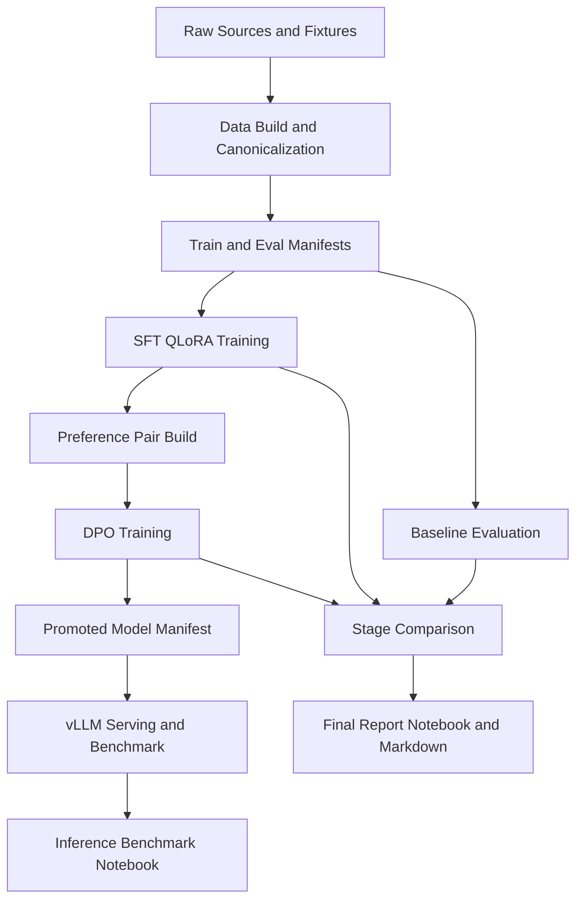

# JSON Extraction with QLoRA + DPO

[](pyproject.toml)
[](#)
[](#)
[](#)
[](#)

Production-style LLM post-training project for **schema-constrained support-ticket
JSON extraction**.  
This repo demonstrates an end-to-end workflow across **baseline -> SFT (QLoRA) -> DPO -> inference benchmarking** with explicit metrics, failure analysis, and reproducibility contracts.

---

## TL;DR

- Built and evaluated a narrow extraction system with strict schema validation.
- Achieved major semantic lift from baseline to SFT, then additional semantic +
  schema gains from DPO.
- Kept claims honest by separating syntax quality from semantic correctness.
- Implemented script-first, resumable vLLM benchmarking with correctness checks.
- Documented engineering decisions, tradeoffs, and open risks as first-class artifacts.

---

## Start Here

- Final project narrative: [`artifacts/reports/final_project_report.md`](artifacts/reports/final_project_report.md)
- Stage comparison report: [`artifacts/reports/dpo-full-colab_comparison_comparison_report.md`](artifacts/reports/dpo-full-colab_comparison_comparison_report.md)
- Inference benchmark notebook: [`notebooks/07_vllm_benchmark_lab.ipynb`](notebooks/07_vllm_benchmark_lab.ipynb)
- System design: [`docs/01_system_design.md`](docs/01_system_design.md)
- Evaluation contract: [`docs/04_eval_plan.md`](docs/04_eval_plan.md)

---

## Why This Project Matters

Most fine-tuning demos optimize for one final score and skip system rigor.  
This repo is intentionally different:

- narrow task definition
- strict schema contract
- reproducible stage artifacts
- explicit failure cases
- honest tradeoff reporting

It is designed to show practical ML engineering skills recruiters look for:
**LLMOps, PEFT, QLoRA, DPO, evaluation harness design, serving benchmarking, and artifact-first reproducibility**.

---

## Key Outcomes (Saved Artifacts)

| Stage | JSON Validity | Schema Pass | Micro F1 | Macro F1 | Mean Latency (ms) |
| --- | ---: | ---: | ---: | ---: | ---: |
| Baseline | 0.9998 | 0.9876 | 0.3030 | 0.3008 | 10760.63 |
| SFT | 0.9990 | 0.8492 | 0.7334 | 0.6519 | 10773.13 |
| DPO | 0.9984 | 0.9982 | 0.7730 | 0.6871 | 16000.42 |

Interpretation:
- **Baseline -> SFT:** primary semantic jump.
- **SFT -> DPO:** schema discipline repair + additional semantic gain.
- **Cost of DPO:** materially higher latency.

This is a mixed, realistic result, not a blanket "everything improved" claim.

Source metrics:
- `artifacts/metrics/baseline-qwen2.5-1.5b_metrics.json`
- `artifacts/metrics/sft-full-colab_eval_metrics.json`
- `artifacts/metrics/dpo-full-colab_eval_metrics.json`

---

## Architecture (High-Level)



Core principle: keep execution logic in `src/` and `scripts/`, keep notebooks
as analysis/reporting surfaces.

---

## Tech Stack And Keywords

- **Language/Runtime:** Python 3.11+
- **Modeling:** Transformers, TRL, PEFT, bitsandbytes (QLoRA)
- **Training:** SFTTrainer, DPOTrainer
- **Validation:** Pydantic schema contracts
- **Serving:** vLLM (OpenAI-compatible API, LoRA serving)
- **Evaluation:** deterministic metrics + diagnostics + stage comparison
- **Workflow:** Colab runtime + Drive persistence + local Git source of truth

Keywords: `LLMOps`, `SFT`, `DPO`, `QLoRA`, `LoRA`, `vLLM`, `Pydantic`,
`artifact-first reproducibility`, `evaluation harness`, `failure analysis`.

---

## AI Engineer Role Alignment

This project is intentionally scoped to demonstrate responsibilities commonly
expected in AI Engineer roles:

### 1) Data And Contract Engineering

- designed a strict schema-first extraction contract
- built canonical data pipelines with source adapters and provenance tracking
- implemented deterministic data-build checks before expensive model runs

### 2) Post-Training And Model Iteration

- implemented staged baseline -> SFT -> DPO workflow
- added preference quality gates to avoid low-signal DPO training
- preserved explicit stage-level artifacts for reproducible comparisons

### 3) Evaluation And Reliability

- built evaluation harness with syntax + semantic separation
- tracked diagnostics, hallucination behavior, and field-level correctness
- documented mixed outcomes and regressions, not just improvements

### 4) Inference And Serving

- integrated vLLM serving with target resolution and LoRA support
- built workload-aware benchmark orchestration with config sweeps
- added resume-safe benchmark checkpointing for real Colab runtime constraints

### 5) Production-Oriented Engineering Habits

- clear separation of source-of-truth repo vs runtime artifacts
- script-first workflows over notebook-only logic
- docs as first-class engineering output (decision log, failure cases, eval plan)

---

## Skills Demonstrated (Recruiter View)

- **LLM fine-tuning:** QLoRA/SFT + DPO pipelines using TRL/PEFT
- **Model evaluation:** robust metric design, diagnostics, and evidence-backed reporting
- **Structured outputs:** schema-constrained JSON extraction and strict validation
- **Inference engineering:** vLLM serving, latency/throughput analysis, tail behavior interpretation
- **System design:** reproducible runtime architecture with explicit contracts
- **Reliability mindset:** checkpoint-resume mechanisms, fail-fast fingerprinting
- **Communication:** decision rationale, tradeoff documentation, failure analysis

---

## If You Are Hiring For AI Engineer

Use this repo to evaluate candidate strength in:

- turning ambiguous ML goals into explicit system contracts
- building trustworthy model-improvement evidence rather than one-off scores
- balancing quality gains against latency and operational constraints
- designing for reproducibility in imperfect runtime environments (for example, Colab)
- communicating technical decisions in a way cross-functional teams can trust

Recommended review flow:

1. start with this README outcomes and architecture
2. verify stage metrics in `artifacts/metrics/`
3. inspect comparison/failure narratives in `artifacts/reports/` and `docs/`
4. review benchmark methodology in `scripts/benchmark_vllm.py` and
   `notebooks/07_vllm_benchmark_lab.ipynb`

---

## Repository Layout

```text
json-extraction-qlora-dpo/
├── configs/               # Data, train, eval, and inference contracts
├── scripts/               # CLI entrypoints for pipeline stages
├── src/json_ft/           # Reusable package modules
├── tests/                 # Deterministic test coverage
├── notebooks/             # Orchestration/review notebooks
├── data/                  # Manifests + fixtures
├── artifacts/             # Saved small metrics/plots/reports/checkpoint metadata
├── docs/                  # Decision, eval, failure, learning trail
└── Makefile               # Local and Drive sync workflow helpers
```

---

## Reproducibility Workflow

### 1) Local development

```bash
python3 -m venv .venv
source .venv/bin/activate
python -m pip install --upgrade pip
python -m pip install -e ".[dev]"
```

### 2) Drive-backed Colab flow

```bash
make drive-init
make drive-push-source
```

Then in Colab:
1. run `notebooks/00_colab_setup.ipynb`
2. build manifests (`scripts/build_dataset_manifests.py --profile full`)
3. run stage notebooks/scripts (baseline, SFT, preference, DPO, compare)
4. run benchmark (`scripts/benchmark_vllm.py`)

Pull small artifacts back:

```bash
make drive-pull-artifacts
```

---

## Inference Benchmarking

Inference workflow is script-first and resumable:

- promptset generation:
  - `scripts/build_benchmark_promptsets.py`
- health checks:
  - `scripts/check_vllm_health.py`
- benchmark orchestration:
  - `scripts/benchmark_vllm.py`
- report rendering:
  - `scripts/render_benchmark_report.py`

Primary analysis surface:
- `notebooks/07_vllm_benchmark_lab.ipynb`

Benchmark run bundle lives in runtime storage:
- `json-ft-runs/persistent/benchmark/<run_name>/bundle.json`

---

## Quality And Honesty Policy

- Never claim improvement without saved metrics.
- Keep syntax and semantic gains separate.
- Treat row-level failures as first-class evidence, not exceptions.
- Report latency costs along with quality gains.
- Preserve reproducibility with explicit paths, contracts, and artifacts.

---

## Ownership

This is a solo portfolio project built as both:
- a practical ML systems artifact
- a learning trail with explicit design rationale and postmortems

---

## What Is Intentionally Not Included

- Committed large model weights/checkpoints
- Full raw external datasets in Git
- Inflated claims without artifact proof

